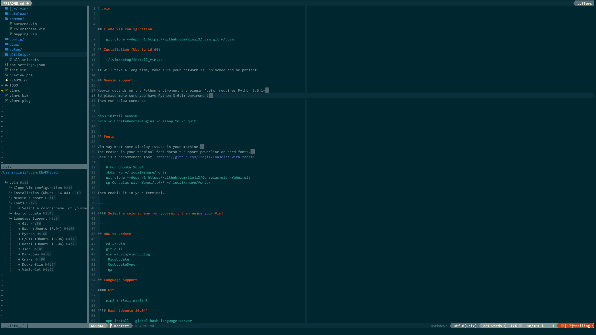

# vim-defx-vista



Inspired by [pseewald/nerdtree-tagbar-combined](https://github.com/pseewald/nerdtree-tagbar-combined),
which opens nerdtree and tagbar compactly on the same side.
This plugin is for open defx and vista compactly like above image.

## Dependency

-   [Shougo/defx.nvim](https://github.com/Shougo/defx.nvim)
-   [liuchengxu/vista.vim](https://github.com/liuchengxu/vista.vim)

## Installation

With vim-plug

```vim
Plug 'linjiX/vim-defx-vista'
```

## Usage

```vim
:ToggleDefxVista
```

## Configuation

```vim
let g:defx_vista_left = 1
" Default: 1
" The window will be opened on the left side of vim
" Change to 0 if you prefer right side

let g:defx_vista_width = 30
" Default: 30
" Width of the defx and vista window
```
